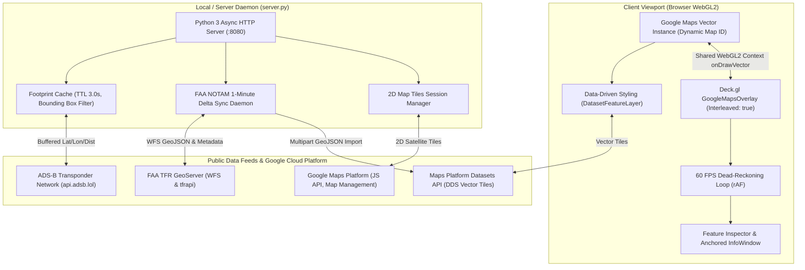

# Architecture Specification: Google Maps DDS Real-Time Aviation Platform

> **System Title**: High-Performance Real-Time Aviation Tracking & Geospatial Intelligence Platform  
> **Core Technologies**: Google Maps JavaScript API (Vector Engine), WebGL2, Deck.gl (Interleaved Overlay), Maps Platform Datasets API (Data-Driven Styling), FAA TFR GeoServer, ADS-B Open Telemetry, Python 3 HTTP Server.  
> **Environment Target**: Google Cloud Platform (GCP) deployed via Antigravity CLI.  
> **Design Principle**: Fully generic, self-contained build architecture with dynamic resource provisioning. Zero hardcoded credentials, API keys, or project-specific IDs.

---

## 1. Executive Summary & Architecture Principles

This platform delivers high-cadence, real-time tactical airspace situational awareness across the Continental United States (CONUS). It unifies three distinct geospatial data paradigms into a single zero-lag WebGL2 viewport:

1. **Native Data-Driven Styling (DDS)**: Vector polygon datasets (USDOT Runways and FAA CONUS Temporary Flight Restrictions) rendered natively inside Google Maps vector engine using client-side declarative styling functions.
2. **WebGL2 Interleaved Overlays**: 2D Satellite/Aerial raster imagery and thousands of moving aircraft rendered in the exact same WebGL draw pass as Google Maps via `deck.GoogleMapsOverlay({ interleaved: true })`, eliminating frame latency, perspective shearing, and DOM z-index desynchronization.
3. **Continuous 60 FPS Dead-Reckoning & Dynamic Footprint Streaming**: Client-driven buffered spatial queries (`+30%` viewport buffer) streaming real-time ADS-B transponder telemetry, forward-projected upon arrival and smoothly interpolated at 60 FPS between backend polling intervals.



---

## 2. WebGL2 Render Pass Architecture & Alpha Compositing

Google Maps Vector JavaScript API operates an internal 3-pass WebGL2 rendering pipeline:

| Pass | Pipeline Stage | Content Rendered | Depth / Alpha Characteristics |
| :--- | :--- | :--- | :--- |
| **Pass 1** | Ground Geometry | Basemap polygons & `FeatureType.DATASET` polygons (Runways, NOTAMs) | Rendered without depth write (`gl.depthMask(false)`). |
| **Pass 2** | `WebGLOverlayView` | `deck.GoogleMapsOverlay({ interleaved: true })` | User WebGL draw pass. Shares Google's camera projection matrix. |
| **Pass 3** | Foreground | Road networks, transit lines, 3D buildings, text labels, markers | Rendered on top of Pass 2 with depth test enabled. |

### The Pass 2 Compositing Challenge & Solution
If Deck.gl draws an opaque raster satellite tile layer in Pass 2 with standard alpha blending (`[SRC_ALPHA, ONE_MINUS_SRC_ALPHA]`), it overwrites the Pass 1 dataset polygons (Runways and NOTAMs), making them invisible on satellite maps.

**The Solution: Destination-Over WebGL Alpha Compositing**
In `app.js`, the 2D satellite `TileLayer`'s sublayer `BitmapLayer` is configured with:
```javascript
parameters: {
  blend: true,
  blendFunc: [773, 1, 773, 1] // GL.ONE_MINUS_DST_ALPHA, GL.ONE
}
```
- Where Google Maps drew dataset polygons in Pass 1, `dst_alpha > 0`, preserving vector colors.
- Where the canvas is transparent (`dst_alpha == 0`), satellite raster pixels fill the frame in lockstep at 60 FPS.
- Topmost aviation layers (`PathLayer`, `ScatterplotLayer`, `IconLayer`) execute with `depthTest: false` and standard alpha blending (`[770, 771, 1, 771]`), ensuring they render crisply above all basemap imagery and polygon datasets.

---

## 3. Dedicated Vector Map IDs & Cloud-Based Map Styling (CBMS)

A single `google.maps.Map` instance cannot dynamically swap Map IDs. The application generates and maintains separate, dedicated Map instances across dedicated DOM containers:

| Mode | Container | Map ID (Generated at Build Time) | Cloud StyleConfig (Generated at Build Time) | Purpose / Features |
| :--- | :--- | :--- | :--- | :--- |
| **Satellite** | `#map-satellite` | `${MAP_ID_SATELLITE}` | `${STYLE_ID_SATELLITE}` | 100% suppression of all 135 base map features. Deck.gl 2D satellite `TileLayer` underlay + native vector DDS. |
| **Hybrid** | `#map-hybrid` | `${MAP_ID_HYBRID}` | `${STYLE_ID_HYBRID}` | Suppresses 60 polygon land/water fills while retaining crisp white borders, highway lines, and typography. |
| **Roadmap** | `#map-roadmap` | `${MAP_ID_ROADMAP}` | Default Vector Style | Standard authentic Google vector roadmap + native vector DDS. Skips raster tile underlay. |
| **Clean Dark**| `#map-clean` | `${MAP_ID_CLEAN}` | `${STYLE_ID_CLEAN}` | Minimalist tactical dark vector theme. Full DDS dataset support via the **Light-Variant Architecture**. |

### The Clean Dark Light-Variant Architecture
Google Maps Datasets API explicitly rejects Cloud StyleConfigs with `"variant": "dark"`:
```
generic::invalid_argument: Datasets are not supported with dark map variants
```
**Resolution**: The Clean Dark style is authored with `"variant": "light"` (compiling to `mapVariants: ["ROADMAP"]`) while systematically styling all geometries to dark tones:
- Water: Deep Midnight (`#0b0f19`)
- Land: Dark Charcoal (`#161922`)
- Political Borders: Dark Slate (`#334155`)
- Highways: Muted Slate (`#334155`)
- Hidden: Buildings, local roads, landcover textures, and POIs (`visible: false`).

---

## 4. Multi-Dataset Data-Driven Styling (DDS) Integration

### 1. USDOT Runways Dataset (Public Source)
- **Public Data Source**: Bureau of Transportation Statistics (BTS) National Transportation Atlas Database:
  `https://geodata.bts.gov/datasets/usdot::runways/about`
- **Dataset Resource**: Provisioned dynamically via Maps Platform Datasets API as `${RUNWAYS_DATASET_ID}` (~8,796 polygon features).
- **Styling**: Classified by surface type:
  - Asphalt (`ASPH`): Charcoal `#334155` with white runway centerline strokes.
  - Concrete (`CONC`): Slate Gray `#475569`.
  - Turf / Grass (`TURF`): Forest Emerald `#15803d`.
  - Dirt / Gravel (`DIRT` / `GRVL`): Warm Amber `#b45309`.
  - Water (`WATER`): Cyan Blue `#0284c7`.

### 2. FAA CONUS NOTAMs Dataset (Public Source)
- **Public Data Source**: FAA TFR WFS GeoServer joined with FAA API metadata:
  - WFS Geometries: `https://tfr.faa.gov/geoserver/TFR/ows?service=WFS&version=1.1.0&request=GetFeature&typeName=TFR:V_TFR_LOC&maxFeatures=2000&outputFormat=application/json&srsname=EPSG:4326`
  - TFR Metadata: `https://tfr.faa.gov/tfrapi/exportTfrList`
- **Dataset Resource**: Provisioned dynamically via Maps Platform Datasets API as `${NOTAMS_DATASET_ID}`.
- **Automated Sync Daemon**: Backend thread checks FAA feeds every 60 seconds. Uses a SHA-256 fingerprint over sorted feature keys to eliminate version churn, uploading a new version via `POST .../datasets/{id}:import` only when real deltas occur.
- **Styling**: High-contrast tactical palettes:
  - VIP / Presidential: Crimson Red `#ef4444` (3px white outline).
  - Security / Defense: Safety Orange `#f97316`.
  - Hazards / Wildfires: Amber Yellow `#eab308`.
  - Space Operations: Electric Violet `#8b5cf6`.
  - Air Shows: Bright Cyan `#06b6d4`.

---

## 5. Live ADS-B Aircraft Streaming & Dead-Reckoning Engine

### 1. Dynamic Buffered Footprint Fetching (Public Source)
- **Public Data Source**: Open ADS-B community feeds (`https://api.adsb.lol`).
- Client calculates current viewport bounds $[S, N, W, E]$ expanded by `+30%` ($\Delta\text{lat} \times 0.30$, $\Delta\text{lon} \times 0.30$).
- Derives radius in nautical miles ($35\text{ nm} \le R \le 1200\text{ nm}$) and passes `lat, lon, dist, south, north, west, east` to `/api/aircraft`.
- Backend queries `api.adsb.lol/v2/lat/{lat}/lon/{lon}/dist/{dist}` with a 3.0s TTL in-memory cache, filtering results by bounding box to eliminate upstream `HTTP 429` rate limits.
- Panning or zooming triggers the map `idle` listener, querying the fresh footprint immediately.

### 2. Arrival Forward-Projection & 60 FPS Dead-Reckoning
- Upon packet arrival, each aircraft's position is forward-projected along its velocity vector by total observation latency $\Delta t = (\text{serverNow} - \text{posTimestamp}) + \Delta t_{\text{network}}$:
  $$\Delta\text{lat} = \frac{v \cdot \Delta t \cdot \cos(\theta)}{111139}, \quad \Delta\text{lon} = \frac{v \cdot \Delta t \cdot \sin(\theta)}{111139 \cdot \cos(\text{lat})}$$
- During the 60 FPS animation loop, aircraft advance along velocity vectors with decoupled exponential decay of drift offsets, eliminating rubber-banding and stalls.
- Deck.gl `IconLayer` and `PathLayer` use `updateTriggers: { getPosition: animFrameCounter, getAngle: animFrameCounter }` to force GPU vertex buffer re-uploads on every frame.

### 3. Live Infowindow & HUD Telemetry Synchronization
- Clicking an aircraft opens `#feature-inspector` and anchors a `google.maps.InfoWindow` to the plane.
- When new telemetry packets arrive (and on every 60 FPS frame), Altitude, Ground Speed, Heading, Vertical Rate, GPS Coordinates, and Telemetry Sequence IDs update dynamically with green visual pulse feedback (`.meta-value-updated`).
- Complete multi-state flight trajectories (up to 2,500+ fixes) are lazy-loaded on demand from `/api/aircraft/{hex}/track` (querying `https://globe.adsb.lol/data/traces/`) with discrete luminous dots rendered at each historical GPS fix.
