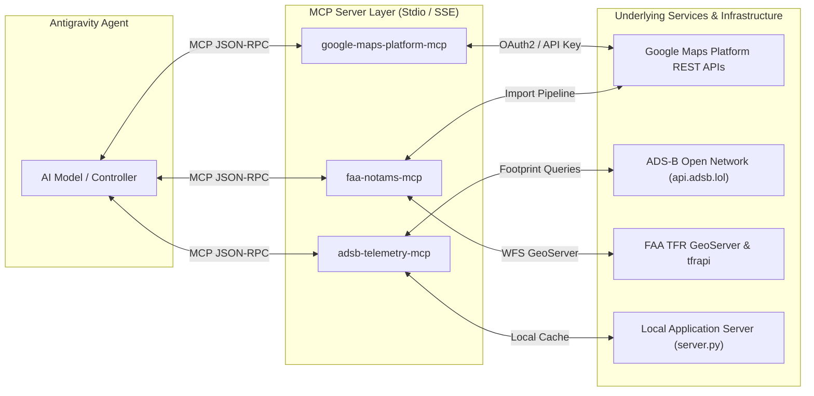

# Model Context Protocol (MCP) Server Specification

> **Target Platform**: Antigravity CLI / Autonomous Agent Architecture  
> **Protocol**: Model Context Protocol (MCP) v1.0  
> **Purpose**: Standardized tool interfaces for managing Google Maps Platform resources, live ADS-B aviation feeds, and FAA NOTAM airspace restrictions.  
> **Design Principle**: Fully generic tool definitions referencing public data feeds and dynamically generated environment variables.

---

## 1. Overview & Architecture

To enable autonomous AI agents (such as Antigravity CLI) to build, configure, inspect, and maintain this application, three dedicated MCP servers are specified:



---

## 2. Server 1: `google-maps-platform-mcp`

Manages Google Cloud Platform Maps resources, Map IDs, StyleConfigs, Datasets API imports, and 2D Tile sessions.

### Tool Definitions

#### `maps_get_map_config`
- **Description**: Retrieves configuration details for a dynamically provisioned Vector Map ID.
- **Parameters**:
  - `map_id` (string, required): The 24-character hexadecimal Map ID generated during build.
  - `project_id` (string, required): Target GCP project ID.

#### `maps_create_style_config`
- **Description**: Creates or updates a Cloud-Based Map Styling (CBMS) StyleConfig.
- **Parameters**:
  - `display_name` (string, required): Friendly name for the style (e.g. `"Aviation-Satellite-ZeroBase"`).
  - `json_style_sheet` (string, required): Stringified JSON CBMS stylesheet.
  - `variant` (string, default `"light"`): Must be `"light"` for Datasets API DDS compatibility.

#### `maps_import_dataset`
- **Description**: Creates a dataset and uploads a GeoJSON file from a public data source for Data-Driven Styling.
- **Parameters**:
  - `display_name` (string, required): Name of the dataset (e.g. `"USDOT Runways CONUS"`).
  - `geojson_path` (string, required): Absolute local filesystem path to the GeoJSON file.
  - `usage` (array of strings, default `["USAGE_DATA_DRIVEN_STYLING"]`): Target usage.

#### `maps_bind_map_context`
- **Description**: Binds a Map ID to a StyleConfig and an array of Dataset IDs.
- **Parameters**:
  - `map_id` (string, required): Target Map ID.
  - `style_config_id` (string, required): Target StyleConfig ID.
  - `dataset_ids` (array of strings, required): Array of Dataset IDs.

#### `maps_create_tiles_session`
- **Description**: Creates a 2D Map Tiles session token for satellite/hybrid imagery.
- **Parameters**:
  - `map_type` (string, default `"satellite"`): `satellite`, `roadmap`, or `terrain`.
  - `overlay` (boolean, default `false`): Set true with `layerTypes: ["layerRoadmap"]` for transparent roads.

---

## 3. Server 2: `adsb-telemetry-mcp`

Provides high-speed spatial and tabular access to real-time ADS-B transponder telemetry, aircraft dead-reckoning vectors, and historical flight tracks from public open data feeds (`api.adsb.lol`).

### Tool Definitions

#### `adsb_query_footprint`
- **Description**: Queries live airborne and ground aircraft within a buffered map viewport from public ADS-B endpoints.
- **Parameters**:
  - `lat` (number, required): Center latitude (-90 to 90).
  - `lon` (number, required): Center longitude (-180 to 180).
  - `dist` (number, default `150`): Radius in nautical miles (35 to 1200).
  - `south` (number, optional): South bounding box limit.
  - `north` (number, optional): North bounding box limit.
  - `west` (number, optional): West bounding box limit.
  - `east` (number, optional): East bounding box limit.

#### `adsb_get_aircraft_track`
- **Description**: Fetches the complete, untruncated historical trajectory path and position fixes for a specific aircraft from public archives (`globe.adsb.lol`).
- **Parameters**:
  - `hex` (string, required): 6-character ICAO hexadecimal aircraft transponder ID (e.g. `a1ff69`).

#### `adsb_get_aircraft_telemetry`
- **Description**: Retrieves instantaneous real-time dead-reckoned position and metadata for a specific flight.
- **Parameters**:
  - `hex` (string, required): 6-character ICAO hex code.

---

## 4. Server 3: `faa-notams-mcp`

Interfaces directly with the public FAA TFR GeoServer and local sync pipeline to inspect active airspace restrictions.

### Tool Definitions

#### `notams_fetch_active`
- **Description**: Fetches the current collection of active CONUS Temporary Flight Restrictions from the public FAA WFS endpoint.
- **Parameters**:
  - `state` (string, optional): 2-letter state code filter (e.g. `"CA"`, `"TX"`).
  - `type` (string, optional): Restriction type (e.g. `"VIP"`, `"SECURITY"`, `"HAZARD"`).

#### `notams_check_delta`
- **Description**: Computes the SHA-256 fingerprint delta of current FAA feeds against the published GCP Datasets API version.
- **Parameters**: None.

#### `notams_trigger_sync`
- **Description**: Forces an immediate sync of FAA TFR data and publishes an updated version to Google Maps Datasets API.
- **Parameters**:
  - `force` (boolean, default `false`): Bypasses the SHA-256 fingerprint check.

---

## 5. Antigravity Configuration Snippet

Add this generic JSON block to `.antigravity/settings.json` or your agent environment configuration. All variables are dynamically read from the build-generated `.env` file:

```json
{
  "mcpServers": {
    "google-maps-platform": {
      "command": "python3",
      "args": [
        "-m",
        "mcp_servers.google_maps_platform"
      ],
      "env": {
        "GCP_PROJECT_ID": "${GCP_PROJECT_ID}",
        "GOOGLE_APPLICATION_CREDENTIALS": "${GOOGLE_APPLICATION_CREDENTIALS}",
        "MAPS_API_KEY": "${MAPS_API_KEY}"
      }
    },
    "adsb-telemetry": {
      "command": "python3",
      "args": [
        "-m",
        "mcp_servers.adsb_telemetry"
      ],
      "env": {
        "LOCAL_SERVER_URL": "http://localhost:${PORT:-8080}"
      }
    },
    "faa-notams": {
      "command": "python3",
      "args": [
        "-m",
        "mcp_servers.faa_notams"
      ],
      "env": {
        "GCP_PROJECT_ID": "${GCP_PROJECT_ID}",
        "NOTAMS_DATASET_ID": "${NOTAMS_DATASET_ID}"
      }
    }
  }
}
```
